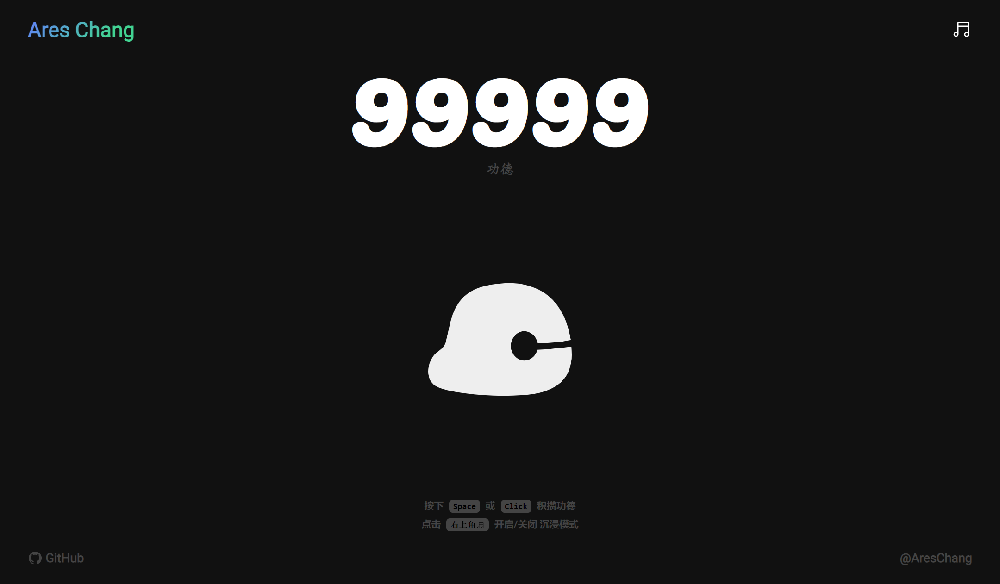

# 🐟WoodenFish

<h3 align='center'>
<a href="https://wfish.areschang.top/" target="_blank">Start Game</a>
</h3>

[](https://wfish.areschang.top/)

> 佛曰：“110010101110010 101000111111011 100111000000000 100111000000111 100111000001011 101110000110001 101001111101111 100111011100101 101001111101100 101010100100100 111100101011110 1001111110011001 101010011011111 1111110”

## 信仰快餐

敲电子木鱼，信虚拟神佛。你说我不虔诚？看我 99999+ 功德法池。

快餐化信仰，无关立场。是兄弟就点我，助我立场成佛！

## 灵感来源

借 埃隆·马斯克 优秀产品思想
"copy [EWoodenFish](https://github.com/liuxiyuan-2022/EWoodenFish)"

感谢源作者开源出优秀 idea

## 技术栈

- ⚡️[SolidJS](https://github.com/solidjs/solid), [Vite 3](https://github.com/vitejs/vite), [pnpm](https://pnpm.io/), [ESBuild](https://github.com/evanw/esbuild) - 快快快快！

- 🎨[UnoCSS](https://github.com/unocss/unocss) - 高性能且极具灵活性的即时原子化 CSS 引擎

- 😃 [各种图标集为你所用](https://github.com/antfu/unocss/tree/main/packages/preset-icons)

- 🦾 [TypeScript](https://github.com/microsoft/TypeScript), 超强壮

- ☁️ 零配置部署 [Netlify](https://www.netlify.com/)

初次尝试使用 [SolidJS](https://www.solidjs.com/) 开发，希望生态起来越完善。

## 现在开始吧!

克隆到本地

```shell
$ git clone https://github.com/Ares-Chang/wooden-fish.git
$ cd wooden-fish
$ npm install
$ npm run dev
```

**强推一个小工具 [ni](https://github.com/antfu/ni) ，用上之后爱不释手。**

```shell
$ git clone git@github.com:liuxiyuan-2022/EWoodenFish.git
$ cd wooden-fish
$ ni
$ nr dev
```
